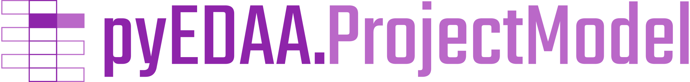

.. include:: shields.inc

.. raw:: html

     

.. raw:: latex

   \part{Introduction}

.. only:: html

   |  |SHIELD:svg:OSVVM-github| |SHIELD:svg:OSVVM-src-license| |SHIELD:svg:OSVVM-ghp-doc| |SHIELD:svg:OSVVM-doc-license| |SHIELD:svg:OSVVM-gitter|
   |  |SHIELD:svg:OSVVM-pypi-tag| |SHIELD:svg:OSVVM-pypi-status| |SHIELD:svg:OSVVM-pypi-python|
   |  |SHIELD:svg:OSVVM-gha-test| |SHIELD:svg:OSVVM-lib-status| |SHIELD:svg:OSVVM-codacy-quality| |SHIELD:svg:OSVVM-codacy-coverage| |SHIELD:svg:OSVVM-codecov-coverage|

.. Disabled shields: |SHIELD:svg:OSVVM-lib-dep| |SHIELD:svg:OSVVM-req-status| |SHIELD:svg:OSVVM-lib-rank|

.. only:: latex

   |SHIELD:png:OSVVM-github| |SHIELD:png:OSVVM-src-license| |SHIELD:png:OSVVM-ghp-doc| |SHIELD:png:OSVVM-doc-license| |SHIELD:svg:OSVVM-gitter|
   |SHIELD:png:OSVVM-pypi-tag| |SHIELD:png:OSVVM-pypi-status| |SHIELD:png:OSVVM-pypi-python|
   |SHIELD:png:OSVVM-gha-test| |SHIELD:png:OSVVM-lib-status| |SHIELD:png:OSVVM-codacy-quality| |SHIELD:png:OSVVM-codacy-coverage| |SHIELD:png:OSVVM-codecov-coverage|

.. Disabled shields: |SHIELD:png:OSVVM-lib-dep| |SHIELD:png:OSVVM-req-status| |SHIELD:png:OSVVM-lib-rank|

--------------------------------------------------------------------------------

The pyEDAA.OSVVM Documentation
##############################

An abstract model of HDL design projects and EDA tooling.

.. _goals:

Main Goals
**********

This package provides OSVVM-specific data models and parsers. The data models can be used as is or converted to generic
data models of the pyEDAA data model family. This includes parsing OSVVM's ``*.pro``-files and translating them to a
pyEDAA.ProjectModel instance as well as reading OSVVM's reports in YAML format like test results, alerts or functional
coverage.

Frameworks consuming these data models can build higher level features and services on top of these models, while
using one parser that's aligned with OSVVM's data formats.

.. _usecase:

Use Cases
*********

.. _news:

News
****

.. _CONTRIBUTORS:

Contributors
************

* :gh:`Patrick Lehmann <Paebbels>` (Maintainer)
* `and more... <https://GitHub.com/edaa-org/pyEDAA.OSVVM/graphs/contributors>`__

.. _LICENSE:

License
*******

.. only:: html

   This Python package (source code) is licensed under `Apache License 2.0 <Code-License.html>`__. |br|
   The accompanying documentation is licensed under `Creative Commons - Attribution 4.0 (CC-BY 4.0) <Doc-License.html>`__.

.. only:: latex

   This Python package (source code) is licensed under **Apache License 2.0**. |br|
   The accompanying documentation is licensed under **Creative Commons - Attribution 4.0 (CC-BY 4.0)**.

.. toctree::
   :hidden:

   Used as a layer of EDA² ➚ <https://edaa-org.github.io/>

.. toctree::
   :caption: Introduction
   :hidden:

   Installation
   Dependency

.. raw:: latex

   \part{Main Documentation}

.. toctree::
   :caption: Main Documentation
   :hidden:

   Project/index

.. raw:: latex

   \part{References and Reports}

.. toctree::
   :caption: References and Reports
   :hidden:

   Python Class Reference <pyEDAA.OSVVM/pyEDAA.OSVVM>
   unittests/index
   coverage/index
   Doc. Coverage Report <DocCoverage>
   Static Type Check Report ➚ <typing/index>

.. Coverage Report ➚ <coverage/index>

.. raw:: latex

   \part{Appendix}

.. toctree::
   :caption: Appendix
   :hidden:

   License
   Doc-License
   Glossary
   genindex
   Python Module Index <modindex>
   TODO
